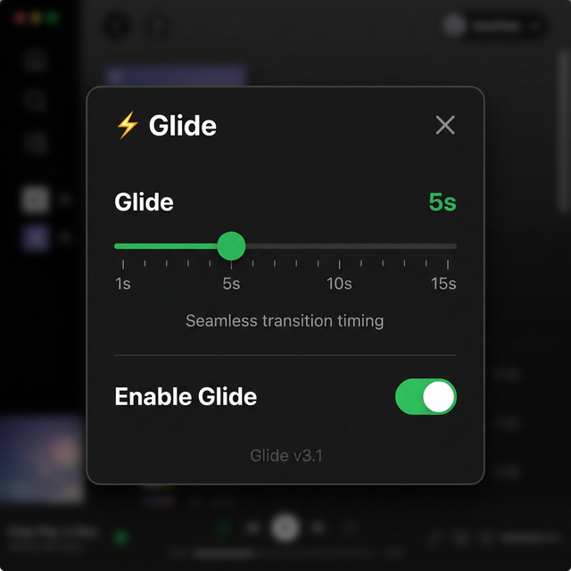

<div align="center">

# ⚡ Project Glide

**Apple Music-style seamless transitions for Spotify desktop.**

[](#)
[](#)
[](#)

</div>

<br/>

**Glide** is a Spicetify extension that brings true, DJ-like seamless crossfades to your Spotify desktop client. Unlike other extensions that simply ramp the volume up and down, Glide leverages **Spotify's native crossfade audio engine** to create a genuine audio overlap where the next track starts playing *before* the current one ends.

## ✨ Features

- **Apple Music-Style "Early Skip"**: The next song begins playing X seconds before the current song finishes, creating a perfect overlap.
- **True Audio Mixing**: Uses Spotify's internal audio engine for a native, zero-latency crossfade. No volume manipulation hacks.
- **Built-in UI**: Features a clean, Spotify-themed settings modal accessible directly from the Playbar.

  

- **Customizable Timing**: A single Glide slider (1–15 seconds) controls exactly when the next track starts early. The backend automatically syncs this duration with Spotify's native crossfade settings in the background.
- **Smart Album Gapless (v3.2)**: Glide automatically detects when you play consecutive tracks from the same album (e.g., Pink Floyd's *Dark Side of the Moon* or a Live Concert album) and temporarily disables the early skip so you can hear the album natively gapless. It turns back on seamlessly when you shuffle!
- **Profile Menu Integration**: Quick toggle to enable/disable Glide right from your Spotify profile dropdown.

---

## 🚀 Installation

### Prerequisites

You must have [Spicetify](https://spicetify.app/) installed and configured on your system.

### Install Steps

1. Download the `glide.js` file from this repository.
2. Copy `glide.js` into your Spicetify extensions directory:
   - **Windows:** `%appdata%\spicetify\Extensions`
   - **Linux/macOS:** `~/.config/spicetify/Extensions`
3. Run the following commands in your terminal to apply the extension:

   ```bash
   spicetify config extensions glide.js
   spicetify apply
   ```

---

## ⚙️ Setup & Configuration

**⚠️ Important Setup Step:**  
For Glide to work its magic, you must **manually enable Spotify's native crossfade option** first.

1. Open Spotify Settings (`Cmd/Ctrl + ,`)
2. Scroll to **Playback**
3. Toggle **Crossfade songs** to ON.
*(Note: The developer of Glide will fully automate this in a future update!)*

### Using the Glide UI

Once installed, you'll see a lightning bolt icon (⚡) in your Spotify playbar. Click it to open the **Glide Settings**:

- **Glide 🔊**: A single slider that controls how many seconds before the current song ends to skip to the next song. This defines the duration of the audio overlap.
- **Smart Gapless (Albums)**: Keep this ON to preserve native 0-second gapless playback for cohesive albums. Turn it OFF if you want to aggressively crossfade everything.
- **Enable Glide**: A master toggle to quickly turn transitions on or off.

---

## 🧠 How it Works

Previous attempts at crossfade extensions manually reduced the volume of Song A, triggered a skip, and increased the volume of Song B. This creates a noticeable dip in volume and no true overlap.

**Glide (v3.0)** fixes this by changing the architecture:

```text
Song A:  ████████████████████████████──────
Song B:              ──────████████████████████████████████
                     ↑
            Player.next() fires here
          (earlyStart seconds before Song A ends)
     Spotify's native crossfade mixes both audio streams natively!
```

By simply skipping early and letting Spotify handle the audio mixing, you get a genuine, studio-quality crossfade.

---

## 🛠️ Troubleshooting

- **Transitions aren't happening:** Ensure Glide is toggled ON (the playbar icon should be green).
- **The song skips, but there's a gap/silence:** Try manually enabling "Crossfade songs" in Spotify's settings (Settings > Playback). While Glide attempts to do this automatically, some older Spotify versions may require you to enable it manually.
- **Transitions trigger too early/late:** Adjust the "Glide" slider in the Glide settings menu to fine-tune the timing.

---

## 📜 License

MIT License. Free to use, modify, and distribute. Developed for the Spicetify community.

---
*created with ❤️ by Janak Choudhary*
